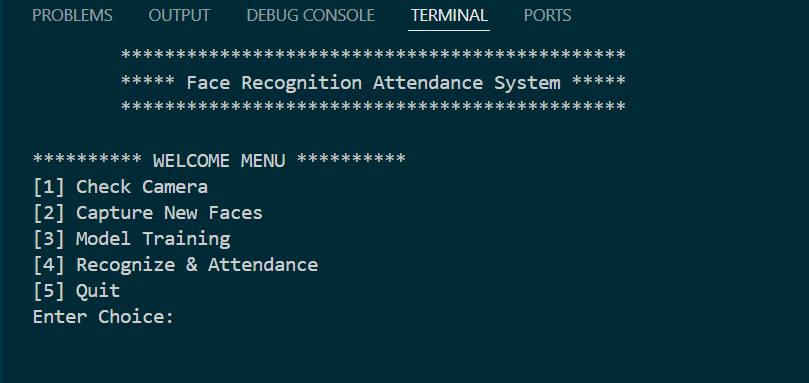
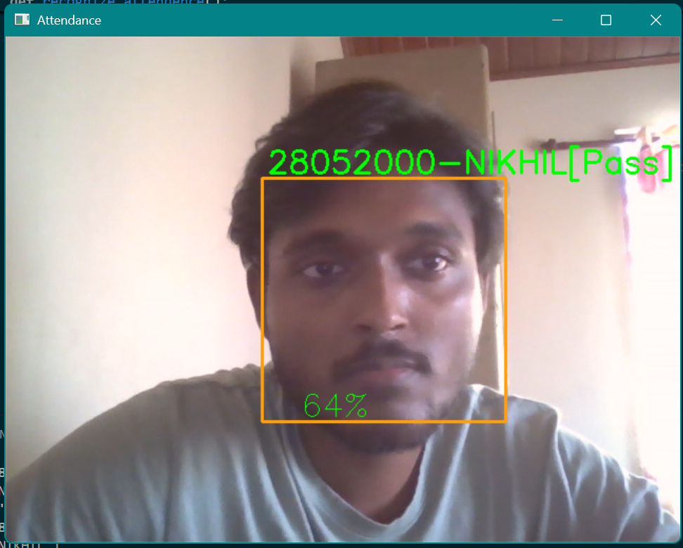

# **Face Recognition Attendance System**

This project implements a real-time face recognition attendance system using OpenCV and Python. It captures facial images, trains a model, and records attendance in a CSV file or database.

## Features

* **Real-time Face Detection:** Uses Haar cascades for efficient face detection.
* **Face Recognition:** Employs the Local Binary Patterns Histograms (LBPH) algorithm for face recognition.
* **Image Capture:** Allows users to capture facial images for training.
* **Model Training:** Trains the LBPH model on the captured images.
* **Attendance Recording:** Records attendance in a CSV file
* **Main File Options:** Simple command-line options to control the system's functionality. 
* **Incremental Model Updates:** Supports adding new faces and retraining the model.

## Prerequisites

* Python 3.10.16
* OpenCV (`opencv-contrib-python`)
* NumPy
* Pandas
* csv
* os
* datetime

## Usage

1.  **Capture Images:**

    * Run the `Capture_Image.py` script to capture facial images for training.
    * Follow the prompts to enter user IDs and names.

2.  **Train the Model:**

    * Run the `Model_Train.py` script to train the LBPH face recognition model.

3.  **Recognize Faces and Record Attendance:**

    * Run the `Recognize.py` script to start the real-time face recognition and attendance recording.
    * Attendance data is recorded in a CSV file or database.

4.  **Main Options File:**

    * Run the `Main.py` file to access the main option menu.
    * This menu allows you to select which function to run.

## Example
    ```markdown
    
    ```

    ```markdown
    
    ```
## 📂 **Project Structure**

```
📁 Face Recognition Attendance System
│-- 📄 Capture_Image.py : Captures facial images for training.
│-- 📄 Model_Train.py : Trains the LBPH face recognition model.
│-- 📄 Recognize.py : Performs real-time face recognition and records attendance.
│-- 📄 haarcascade_frontalface_default.xml : Haar cascade classifier for face detection.
│-- 📄 TrainingImage/ : Directory to store training images.
│-- 📄 StudentDetails/ : Directory to store student details CSV file.
│-- 📄 attendance.csv : CSV file to store attendance records.
│-- 📄 requirements.txt    # Dependencies
│-- 📄 README.md           # Project documentation
```
